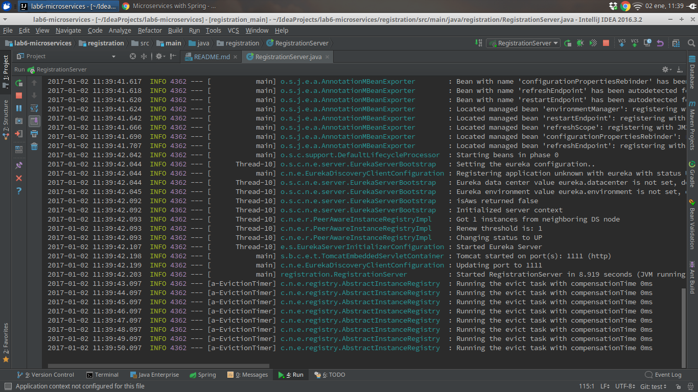
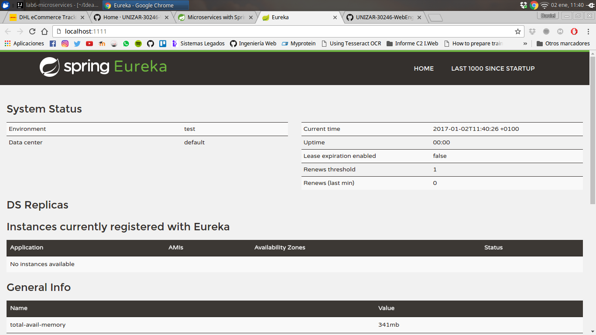
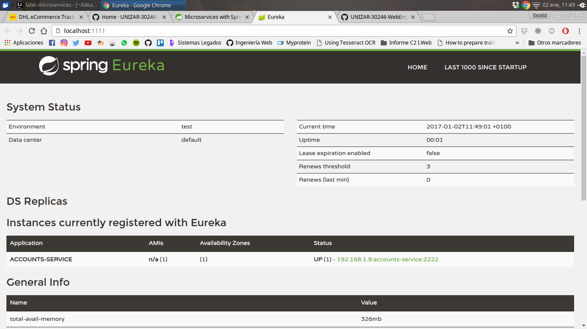
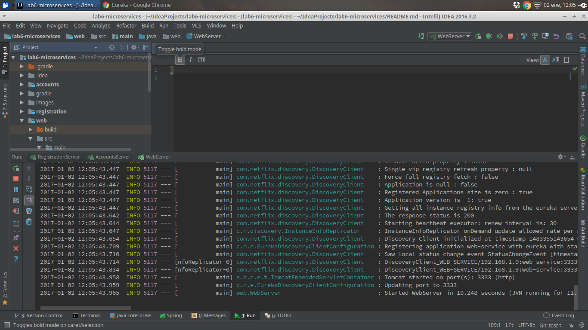
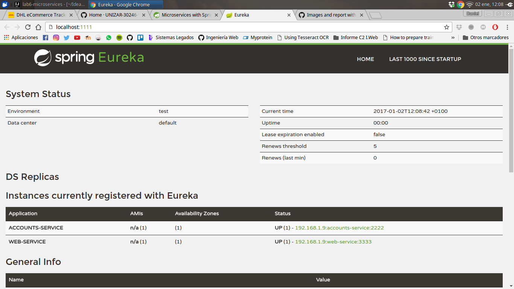
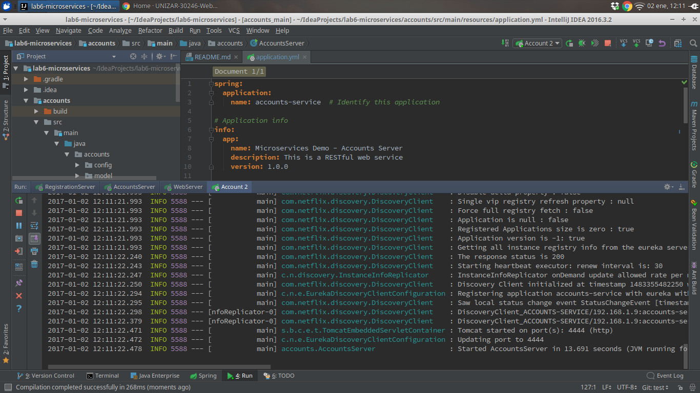
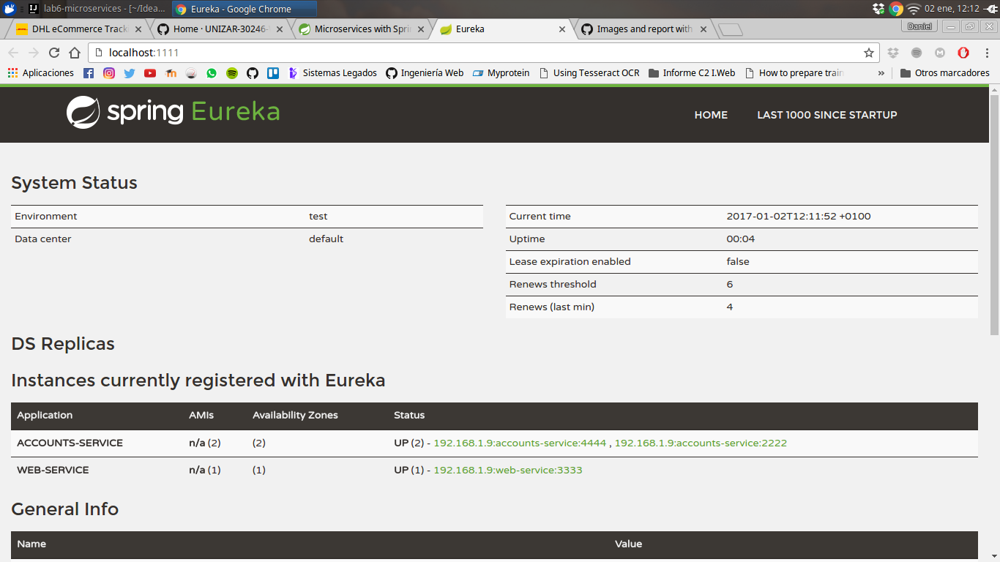
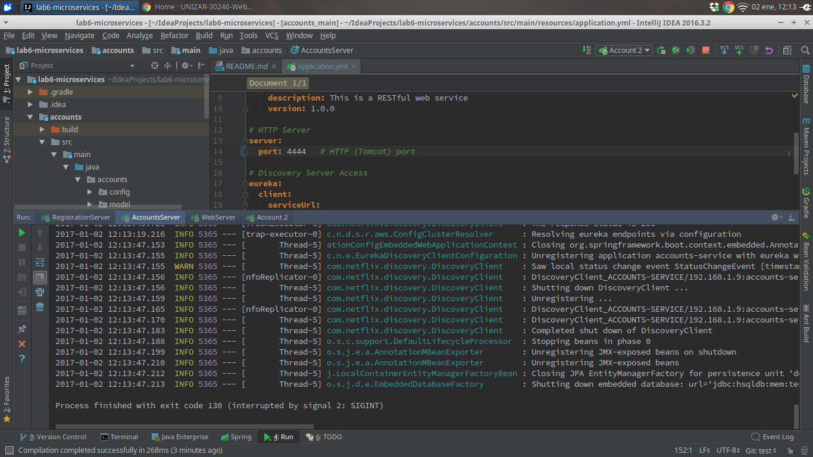
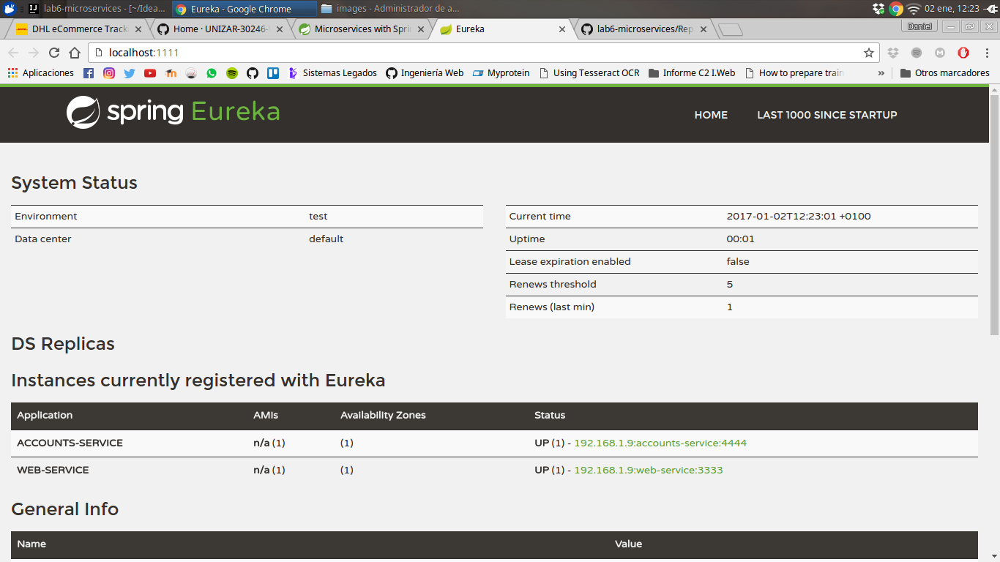

# Registration Service
Registration service started.

#Account Service
Account service started on port 2222.

#Web Service
Web service started on port 3333.

The two services are registered on the registration micro-service.

#Second account service
A new account service is started on port 4444.

The three services are registered on the registration micro-service.

#Killing account service
The account service on port 2222 is killed.

Now there are 2 micro-services registered on registration service.

The registration service can't provide information about account service on port 2222 because there's no connection so,
it can't be registered on the registration service.