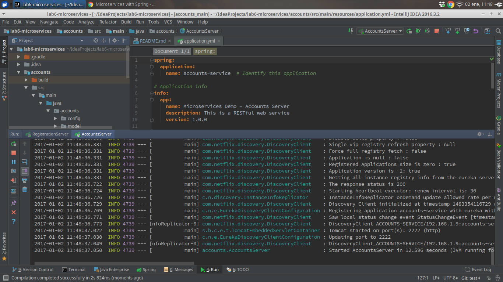

# Registration Service
Registration service started.

#Account Service
Account service started on port 2222.

#Web Service
Web service started on port 3333.

The two services are registered on the registration micro-service.

#Second account service
A new account service is started on port 4444.

The three services are registered on the registration micro-service.

#Killing account service
The account service on port 2222 is killed.

Now, when the web service tries to communicate with the account service on port 2222, it gets a connection refused. Then, the web service communicates with Eureka asking for an account service, Eureka gives to it the account service on port 4444 and the web service can work again.

One account service.

The web service keeps working thanks to Eureka.
